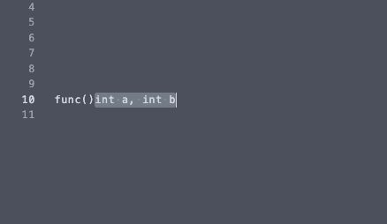

MvVis
=====

Move visually selected text



## Installation

Use your favourite plugin manager to install miniSnip:

#### [minPlug](https://github.com/Jorengarenar/minPlug):
```vim
MinPlug Jorengarenar/vim-MvVis
```

#### [vim-plug](https://github.com/junegunn/vim-plug):
```vim
Plug 'Jorengarenar/vim-MvVis'
```

#### Vim's packages
```bash
cd ~/.vim/pack/plugins/start
git clone git://github.com/Jorengarenar/vim-MvVis.git
```

## Usage

Pressing <kbd>H</kbd>/<kbd>L</kbd> will shift your selection one column to the
left/right. Pressing number then <kbd>H</kbd>/<kbd>L</kbd> will move selection
by that amount of columns.

Same goes for visual block selection.

In case of line selection, instead of columns, selection will be moved up/down.

## Configuration

To disable default mappings (<kbd>H</kbd>, <kbd>L</kbd>) set variable
`g:MvVis_mappings` to `0` and define your own, e.g.:
```vim
vmap <C-h> <Plug>(MvVisLeft)
vmap <C-l> <Plug>(MvVisRight)
```
